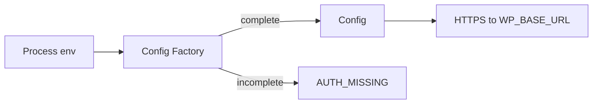

# TDD: env-auth

## 1. Header & Metadata

| Field | Value |
|-------|-------|
| Title | env-auth — configuração e autenticação da instância MCP |
| Status | Draft |
| Date | 2026-08-17 |
| Last updated | 2026-08-17 |
| Tech lead | TBD |
| Team | TBD |
| Epic / ticket | TBD |
| Size | Small |
| Type | Integration |
| Depends on | (none) |
| Source harness | `docs/harness/features/feature-env-auth.md` |

## 2. Technical Solution

**Design pattern (escolhido):** Factory — construir a configuração a partir do ambiente ou falhar com `AUTH_MISSING`. Não arrancar um processo “meio autenticado”.

Uma instância MCP liga-se a **um** `WP_BASE_URL`. A Factory lê o ambiente (ficheiro `.env` no cwd, `DOTENV_PATH`, ou variáveis do serviço) e produz um objecto de config imutável para o processo, ou recusa o boot.



Data flow:

1. Boot lê variáveis obrigatórias.
2. Se `WP_APP_PASSWORD` está definido: Authorization Basic `WP_APP_USER:WP_APP_PASSWORD`.
3. Senão, se o par WC consumer está completo: Basic `WC_CONSUMER_KEY:WC_CONSUMER_SECRET`.
4. Senão: `AUTH_MISSING`; zero HTTP.
5. Todo pedido HTTPS usa só o host de `WP_BASE_URL` (HTTPS, sem trailing slash). Redirect para outro host é recusado.

### Config contract

| Variável | Obrigatória | Função |
|----------|-------------|--------|
| `WP_BASE_URL` | sim | origem HTTPS da loja |
| `WP_APP_USER` + `WP_APP_PASSWORD` | sim* | Application Password |
| `WC_CONSUMER_KEY` + `WC_CONSUMER_SECRET` | alternativa* | Basic WC |
| `WP_STORE_ID` | recomendada | identidade em logs |
| `WP_ENVIRONMENT` | recomendada | `local` \| `staging` \| `production` |
| `WP_MCP_ALLOWED_STATUSES` | não | default `draft,publish,pending` |
| `WP_MCP_USER_LOGIN` | não | default = `WP_APP_USER` |
| `DOTENV_PATH` | não | path absoluto do `.env` |

\*Obrigatório Application Password **ou** o par WC. Query `consumer_key` / `consumer_secret` proibida.

Não há persistência local. Sem migrações.

### Auth header (exemplo)

Pedido à loja: `Authorization: Basic` base64(user:secret). Tools **não** aceitam `base_url` nem passwords nos argumentos.

## 3. Context Pillars

Fonte: harness `feature-env-auth.md` (verbatim).

### 1 — Como descreve a feature?

O MCP é um pacote genérico. Para apontar a uma loja: copiar `.env.example` → `.env` e preencher. Arranque recusa se faltar qualquer variável marcada obrigatória.

Não ler `wp-config.php`, não pedir chaves ao agente, não aceitar `base_url` / `password` nos argumentos das tools.

Credenciais **só** no `.env`. Nunca no git, nunca no código, nunca em tool input, nunca em logs de resposta. Versionar apenas `.env.example`. Uma instância MCP = um `.env`. Loja A, loja B, homolog e produção são quatro `.env` (ou quatro cópias do processo), nunca quatro forks do código.

### 2 — Qual problema objetivamente ela resolve?

O código do MCP não contém URL, utilizador, passwords nem nomes de loja. Sem um carregamento de env obrigatório e fechado, o mesmo binário não pode servir outra loja sem vazar segredos ou misturar alvos.

### 3 — Qual a solução esperada? Quais trade-offs ela envolve?

O processo MCP carrega **um** `.env` do cwd ou de `DOTENV_PATH`. Em Cursor/Coolify: `envFile` / env do serviço apontando para esse ficheiro.

Obrigatório Application Password **ou** o par WC consumer. Recusar boot se nenhum dos dois estiver completo.

Prioridade de auth: se `WP_APP_PASSWORD` existir, usar Basic `user:app_password`. Senão, Basic `WC_CONSUMER_KEY:WC_CONSUMER_SECRET` (query `consumer_key` / `consumer_secret` **proibida** em URLs e logs).

Trade-off: um processo não é multi-loja; mudar de alvo exige outro env/processo, não uma lista de lojas no código.

### 4 — Qual exemplo ou contexto temos do problema e da solução?

`.env.example` (versionado; valores fake) em `my_docs/mcpContext.md` §4.3:

```
WP_STORE_ID=minha-loja
WP_ENVIRONMENT=staging
WP_BASE_URL=https://loja.example.com
WP_APP_USER=mcp-content
WP_APP_PASSWORD=xxxx xxxx xxxx xxxx xxxx xxxx
# WC_CONSUMER_KEY=
# WC_CONSUMER_SECRET=
WP_MCP_ALLOWED_STATUSES=draft,publish,pending
WP_MCP_USER_LOGIN=mcp-content
```

Cursor: um servidor MCP por loja no `mcp.json`, cada um com `envFile` próprio. Coolify: env vars do recurso = conteúdo do `.env`; não montar `.env` na imagem.

## 4. Context

O produto é um servidor MCP reutilizável apontado a WordPress + WooCommerce. Agentes (Cursor, clientes remotos) não devem ver nem colar passwords. Cada loja e cada ambiente (homolog vs produção) é uma instância com env próprio.

Stakeholders: quem opera o MCP (agência/editores via agente), quem gere o `.env` na loja, quem sobe o serviço (Cursor `envFile` ou Coolify).

Estado actual: harness e `mcpContext` definem o contrato; o binário ainda não implementa (docs-first).

## 5. Problem Statement & Motivation

- Sem Factory fechada, um processo pode arrancar sem credenciais e o agente improvisar `base_url` no chat — misturar lojas ou vazar secrets.
- Consumer keys na query string aparecem em access logs do host — impacto de compromisso das chaves WC.
- Não resolver agora bloqueia todas as tools (INV-003): não há HTTP seguro à loja.

Quantificação de horas/custo: TBD.

## 6. Scope

In scope (V1):

- Load de um env por processo; recusa `AUTH_MISSING`
- Prioridade App Password vs par WC
- `WP_BASE_URL` único; recusar redirect de host
- Recusar credenciais em tool input; não logar secrets
- Documentar `.env.example` com placeholders

Out of scope:

- Lista de lojas no mesmo processo
- Ler `wp-config.php`
- Pedir passwords ao agente
- PHP da loja / filtros no tema
- Multi-tenant runtime

Future (V2+):

- TBD: rotação de Application Password sem restart
- TBD: health que não imprime env
- TBD: validação extra de `WP_ENVIRONMENT`

## 7. Risks

| Risk | Impact | Probability | Mitigation |
|------|--------|-------------|------------|
| Env incompleto em produção | H | M | Boot fail-closed `AUTH_MISSING`; checklist de deploy |
| Consumer key na URL por engano | H | L | Policy: query consumer proibida; testes |
| Redirect para host atacante | H | L | Recusar Location ≠ `WP_BASE_URL` |
| `.env` commitado | H | M | gitignore; só `.env.example` versionado |

## 8. Implementation Plan

Cada fase: teste a falhar (**Red**) → mínimo a passar (**Green**) → refactor. Owner TBD.

| Phase | Task | TDD cycle | Owner | Estimate |
|-------|------|-----------|-------|----------|
| 1 | Factory a partir de env | Red: boot sem credenciais → `AUTH_MISSING` → Green: parse + recusa | TBD | 0.5d |
| 2 | Prioridade App Password vs WC | Red: dois modos de Basic, sem query consumer → Green: header correcto | TBD | 0.5d |
| 3 | Host único + redirect | Red: Location outro host recusado → Green: check de host | TBD | 0.5d |

## 9. Security Considerations

- Authn: Basic a partir do env; nunca cookies; nunca tool args.
- Authz: este TDD só estabelece identidade HTTP da instância; allowlist de rotas é Policy no runtime.
- Em trânsito: HTTPS para `WP_BASE_URL`.
- Em repouso: secrets no secret store / env do serviço, não na imagem.
- PII: não logar Authorization nem passwords.
- Compliance: TBD (LGPD — não persistir PII neste processo).
- Input: tools não expõem campos de credencial.

## 10. Testing Strategy

| Type | Scope | Approach |
|------|-------|----------|
| Unit | Factory, prioridade auth, `AUTH_MISSING` | env fake; sem rede |
| Integration | Header Basic; URL sem consumer query | httptest |

Cenários críticos: boot vazio; só App Password; só WC pair; tool com `base_url`; redirect off-host.

## 16. Dependencies

- WordPress Application Passwords ou WooCommerce REST keys na loja (fora deste binário).
- TDD mcp-runtime e demais features dependem deste contrato.
- PHP da loja: fora; não bloqueia este TDD.
