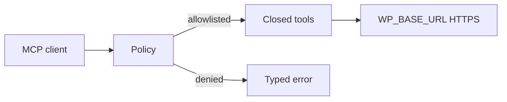

# TDD: mcp-runtime

## 1. Header & Metadata

| Field | Value |
|-------|-------|
| Title | mcp-runtime — servidor MCP de tools fechadas |
| Status | Draft |
| Date | 2026-08-17 |
| Last updated | 2026-08-17 |
| Tech lead | TBD |
| Team | TBD |
| Epic / ticket | TBD |
| Size | Small |
| Type | Integration |
| Depends on | env-auth |
| Source harness | `docs/harness/features/feature-mcp-runtime.md` |

## 2. Technical Solution

**Design pattern (escolhido):** Policy — allowlist de tools, rotas, métodos e campos **antes** de qualquer I/O HTTP. Sem tool genérica.

O processo expõe um servidor MCP (stdio para cliente local; Streamable HTTP para cliente remoto). A Policy é o único sítio que autoriza o conjunto fechado de tools e os códigos de erro estáveis.



Data flow:

1. Cliente lista tools → só o conjunto §7.
2. Invocação: JSON Schema allowlisted → Policy de chaves/rotas/métodos → HTTP → sanitizar resposta.
3. Chave proibida → `FIELD_FORBIDDEN` sem chamar a loja (não strip silencioso).

### Tool contract (conjunto fechado)

| Tool | Recurso |
|------|---------|
| `list_posts`, `get_post`, `upsert_post` | posts |
| `list_pages`, `get_page`, `upsert_page` | pages |
| `list_products`, `get_product_content`, `update_product_content` | product content |
| `upload_media` | media |
| `list_coupons`, `create_coupon`, `update_coupon`, `delete_coupon` | coupons |

Erros: `FIELD_FORBIDDEN`, `ROUTE_FORBIDDEN`, `METHOD_FORBIDDEN`, `AUTH_MISSING`, `DISCOUNT_CONFIRMATION_REQUIRED`.

Instruções do servidor: conteúdo + cupons; recusar preço/stock de produto e contas; cupom percent > 20 → confirmação humana; default `draft` em post/página; não inventar tools.

Transporte: o mesmo contrato de tools em stdio e Streamable HTTP. Sem persistência.

## 3. Context Pillars

Fonte: harness `feature-mcp-runtime.md` (verbatim).

### 1 — Como descreve a feature?

Servidor MCP **reutilizável** para qualquer loja WordPress + WooCommerce. Agentes (Cursor, Claude, etc.) editam conteúdo: páginas, posts, textos/imagens de produtos, e cupons/promoções (`/wc/v3/coupons`).

Mesmo binário MCP: carrega env da loja/ambiente, allowlist de tools + strip de campos proibidos, HTTPS para `WP_BASE_URL`.

Só estas tools existem. Não há `wp_request`, `fetch`, `sql`, `wp_cli`, `eval`.

Instruções do servidor e description de cada tool: páginas, posts, conteúdo de produto e cupons; recusar preço/stock de produto e contas; percentagem de cupom > 20 exige AskQuestion; não inventar tools; não pedir passwords no chat; default de criação de post/página `draft`.

Transporte: stdio (Cursor) e Streamable HTTP (Coolify), SDK oficial `modelcontextprotocol/go-sdk`.

### 2 — Qual problema objetivamente ela resolve?

O WooCommerce traz um adapter MCP (`/woocommerce/mcp`) que expõe abilities REST, incluindo `woocommerce/products-update` (preço e stock), create/delete de produtos, encomendas e outras operações de loja.

Quem usa um MCP aberto consegue alterar dinheiro, stock, contas e operações da loja. Este caso de uso precisa de tools fechadas.

### 3 — Qual a solução esperada? Quais trade-offs ela envolve?

Este projecto usa um MCP **próprio**, com tools fechadas (tabela §7). Feature `mcp_integration` do Woo deve permanecer desligada no site (fora deste repo).

Regras de cada tool de escrita: (1) JSON Schema só allowlisted (2) `assert_no_forbidden_keys` — erro, não strip silencioso (3) chamar WP (4) sanitizar a resposta.

Códigos fixos: `FIELD_FORBIDDEN`, `ROUTE_FORBIDDEN`, `METHOD_FORBIDDEN`, `AUTH_MISSING`, `DISCOUNT_CONFIRMATION_REQUIRED`.

Trade-off: não é proxy genérico da WP/WC REST; tools em falta ficam em falta. Não implementar o MCP como página no browser.

### 4 — Qual exemplo ou contexto temos do problema e da solução?

Arquitectura em `my_docs/mcpContext.md` §3:

```
Agente (Cursor / Claude)
    → mesmo binário MCP
        → carrega .env da loja/ambiente
        → allowlist de tools + strip de campos proibidos
        → HTTPS para WP_BASE_URL
```

Tools: `list_posts`, `get_post`, `upsert_post`, `list_pages`, `get_page`, `upsert_page`, `list_products`, `get_product_content`, `update_product_content`, `upload_media`, `list_coupons`, `create_coupon`, `update_coupon`, `delete_coupon`.

## 4. Context

Agentes ligam-se a MCPs. O Woo nativo é amplo demais para editores. Este runtime é a superfície única: Policy decide o que existe.

Stakeholders: operadores Cursor/Coolify; editores via agente; quem mantém o harness.

## 5. Problem Statement & Motivation

- MCP Woo nativo permite preço/stock/encomendas — um agente “útil” altera dinheiro.
- HTTP genérico (`wp_request`) anula a allowlist.
- Sem códigos de erro estáveis o modelo inventa workarounds.

Impacto se não: INV-002/004 não têm ponto de enforcement no protocolo. Quantificação: TBD.

## 6. Scope

In scope (V1):

- Conjunto fechado de tools §7
- Policy antes de HTTP; erros tipados
- Instruções de recusa (preço produto, contas) e gate cupom >20%
- stdio e Streamable HTTP com o mesmo conjunto
- Default `draft` em criação de post/página

Out of scope:

- `/woocommerce/mcp`
- Tools `fetch` / SQL / WP-CLI
- UI browser que chama `/wp-json`
- PHP da loja

Future (V2+):

- TBD: variações de produto (só conteúdo)
- TBD: mais taxonomias
- TBD: métricas de processo

## 7. Risks

| Risk | Impact | Probability | Mitigation |
|------|--------|-------------|------------|
| Tool extra “só para debug” | H | M | Policy: conjunto = §7; testes de lista de tools |
| Strip silencioso de preço | H | M | `FIELD_FORBIDDEN`; testes |
| Woo MCP nativo ligado na loja | H | L | Fora deste binário; instruções não sugerem ligar |
| Transporte HTTP exposto no browser | M | L | Sem CORS; não é app web |

## 8. Implementation Plan

| Phase | Task | TDD cycle | Owner | Estimate |
|-------|------|-----------|-------|----------|
| 1 | Lista de tools = §7 | Red: sem `wp_request` → Green: registry Policy | TBD | 1d |
| 2 | Erros tipados + schema | Red: chave proibida → `FIELD_FORBIDDEN` → Green: Policy | TBD | 1d |
| 3 | stdio + Streamable HTTP | Red: mesmo conjunto nos dois transportes → Green: um servidor | TBD | 1d |

## 9. Security Considerations

- Authn: depende de env-auth.
- Authz: Policy deny-by-default.
- Secrets: não em logs nem em tool results.
- HTTPS outbound.
- PII: respostas sanitizadas (INV-008).
- Rate limit: TBD no host da loja.

## 10. Testing Strategy

| Type | Scope | Approach |
|------|-------|----------|
| Unit | Policy, schema, códigos | sem rede |
| Integration | invocação de tool → fake HTTP | httptest |

Cenários: lista exacta de tools; `FIELD_FORBIDDEN`; `AUTH_MISSING`; sem HTTP genérico.

## 16. Dependencies

- env-auth (boot).
- Features de conteúdo, media, produtos, cupons registam-se neste runtime.
- Loja: Woo `mcp_integration` desligada (operação da loja, não deste TDD).
