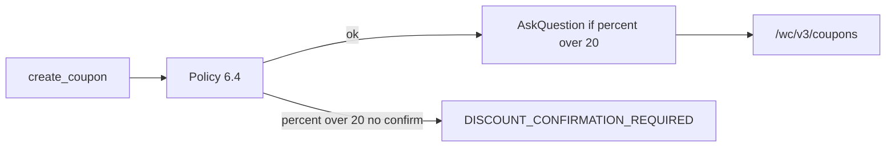

# TDD: woocommerce-coupons-and-promotions

## 1. Header & Metadata

| Field | Value |
|-------|-------|
| Title | woocommerce-coupons-and-promotions — cupons WooCommerce |
| Status | Draft |
| Date | 2026-08-17 |
| Last updated | 2026-08-17 |
| Tech lead | TBD |
| Team | TBD |
| Epic / ticket | TBD |
| Size | Small |
| Type | Integration |
| Depends on | env-auth, mcp-runtime |
| Source harness | `docs/harness/features/feature-woocommerce-coupons-and-promotions.md` |

## 2. Technical Solution

**Design pattern (escolhido):** Policy — allowlist de campos de cupom; DELETE só em `/wc/v3/coupons/{id}`; percent > 20 exige confirmação humana (INV-009), não silêncio.

Promoção = cupom. Não é `sale_price` no produto.

### HTTP contract

| Tool | Method | Path |
|------|--------|------|
| `list_coupons` | GET | `/wp-json/wc/v3/coupons` |
| `create_coupon` | POST | `/wp-json/wc/v3/coupons` |
| `update_coupon` | PATCH | `/wp-json/wc/v3/coupons/{id}` |
| `delete_coupon` | DELETE | `/wp-json/wc/v3/coupons/{id}` |

Write allowlist: `code`; `discount_type` (`percent` \| `fixed_cart` \| `fixed_product`); `amount`; datas de validade; âmbito carrinho vs produto/categoria (`product_ids` / `product_categories`).

Se `discount_type=percent` e `amount` > 20: não chamar a loja até confirmação humana; senão `DISCOUNT_CONFIRMATION_REQUIRED`.

DELETE de post/página/produto/media continua `METHOD_FORBIDDEN`.

Read de cupom **pode** incluir amount/type/datas (INV-008: excepção vs preço de produto).

Timeout 10s; writes sem retry.

## 3. Context Pillars

Fonte: harness `feature-woocommerce-coupons-and-promotions.md` (verbatim).

### 1 — Como descreve a feature?

o usuario deve poder criar, editar e excluir cupons de desconto, assim como definir suas datas de de validade, os cupons devem poder ser setados como % ou valor absoluto, e se serão sobre o valor do carriho ou do tipo de produto atrelado a ele.

Promoção = o mesmo que cupom (não é `sale_price` em produto).

### 2 — Qual problema objetivamente ela resolve?

vai mitigar a dificuldade de criar e manipular cupons no woocommerce, removendo ambiguidades que o painal admin atual causa

### 3 — Qual a solução esperada? Quais trade-offs ela envolve?

deve ter as tools create, list, update e delete, seguindo o mesmo padrão que expliquei na pergunta 1, o principal trade-off é o usuario delegar essa criação completamente para a iA, caso isso aconteça sempre travave criações de cupons de mais de 20% e pergunte via AskQuestion se o usuário quer isso mesmo

Tools: `list_coupons`, `create_coupon`, `update_coupon`, `delete_coupon`. Paths: GET/POST `/wp-json/wc/v3/coupons`, GET/PATCH/DELETE `/wp-json/wc/v3/coupons/{id}`.

Allowlist de escrita: código; `discount_type` (`percent` | `fixed_cart` | `fixed_product`); `amount`; datas de validade; âmbito carrinho vs produto/categoria atrelado.

Gate: se `discount_type` é `percent` e `amount` > 20, a tool **não** chama a loja até o humano confirmar via AskQuestion. Sem confirmação → `DISCOUNT_CONFIRMATION_REQUIRED`.

### 4 — Qual exemplo ou contexto temos do problema e da solução?

(pedido explícito: completar com o já respondido) painel admin Woo ambíguo vs tools `create`/`list`/`update`/`delete` com validade, `%` ou valor absoluto, âmbito carrinho vs tipo de produto; criação >20% pára e AskQuestion.

## 4. Context

O painel Woo de cupons é ambíguo para quem opera via agente. Desconto de loja faz-se com cupom, não alterando preço de produto (INV-002).

## 5. Problem Statement & Motivation

- Admin Woo mistura tipos de desconto; o agente precisa de tools explícitas.
- Delegar 100% à IA pode criar percentagens profundas — gate 20% (INV-009).
- Sem DELETE de cupom o ciclo de vida fica incompleto; DELETE genérico destruiria conteúdo.

Quantificação: TBD.

## 6. Scope

In scope (V1):

- list/create/update/delete cupons
- % ou valor; validade; carrinho vs produto atrelado
- gate percent > 20 + AskQuestion

Out of scope:

- `sale_price` / `regular_price` / stock de produto
- encomendas, clientes
- PHP da loja
- Woo MCP nativo

Future (V2+):

- TBD: usage limits / emails de cupom
- TBD: gate para `fixed_*` acima de um tecto
- TBD: cupons de afiliado

## 7. Risks

| Risk | Impact | Probability | Mitigation |
|------|--------|-------------|------------|
| Cupom 50% sem humano | H | H | INV-009; `DISCOUNT_CONFIRMATION_REQUIRED` |
| DELETE de produto via “mesmo DELETE” | H | M | Policy: DELETE só coupons |
| Agente usa sale_price | H | M | product-content `FIELD_FORBIDDEN` |

## 8. Implementation Plan

| Phase | Task | TDD cycle | Owner | Estimate |
|-------|------|-----------|-------|----------|
| 1 | list/create ≤20% | Red: POST `/coupons` allowlist → Green | TBD | 1d |
| 2 | update/delete cupom | Red: DELETE só cupom → Green | TBD | 0.5d |
| 3 | gate >20% | Red: sem confirm → `DISCOUNT_CONFIRMATION_REQUIRED`, zero HTTP → Green | TBD | 0.5d |

## 9. Security Considerations

- Authn: env-auth. User WP precisa de capabilities de cupom sem `manage_woocommerce` se a loja o permitir.
- Authz: Policy 6.4; INV-009.
- Cupom amount é intencional na resposta; preço de produto continua oculto.
- Confirmação >20% é humana (AskQuestion), não um default.
- PHP na loja: se `rest_pre_dispatch` bloquear todo DELETE, a loja tem de exceptuar `/wc/v3/coupons/{id}` (fora deste binário).

## 10. Testing Strategy

| Type | Scope | Approach |
|------|-------|----------|
| Unit | Policy 6.4, INV-009 | — |
| Integration | fake WC coupons | httptest |

Cenários: create percent 10; percent 25 sem confirm; percent 25 com confirm; DELETE cupom OK; DELETE produto forbidden; `sale_price` em produto continua forbidden.

## 16. Dependencies

- env-auth, mcp-runtime.
- product-content permanece sem `sale_price`.
- WC REST `/wc/v3/coupons` na loja.
- Confirmação >20%: canal AskQuestion no cliente agente.
