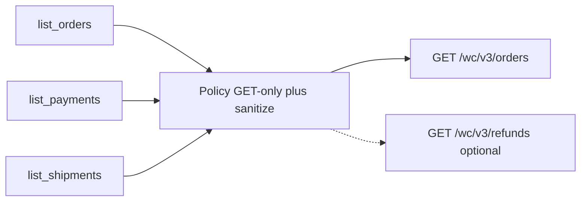

# TDD: woocommerce-orders-payments-shipments-read

## 1. Header & Metadata

| Field | Value |
|-------|-------|
| Title | woocommerce-orders-payments-shipments-read — listagens GET de pedidos, pagamentos e envios |
| Status | Draft |
| Date | 2026-08-17 |
| Last updated | 2026-08-17 |
| Tech lead | TBD |
| Team | TBD |
| Epic / ticket | TBD |
| Size | Small |
| Type | Feature |
| Depends on | env-auth, mcp-runtime |
| Source harness | `docs/harness/features/feature-woocommerce-orders-payments-shipments-read.md` |

## 2. Technical Solution

**Design pattern (escolhido):** Policy — allowlist GET-only; sanitização (sem email/telefone/morada); `METHOD_FORBIDDEN` / `ROUTE_FORBIDDEN` em POST/PUT/PATCH/DELETE de pedidos.

As três tools são projecções do mesmo recurso WooCommerce. Não existem recursos nativos `payments` nem `shipments` de transacções na REST v3.

GET de secções antes proibidas só entra na allowlist quando o humano pede a feature. POST/PUT/PATCH/DELETE nessas secções **não** se adicionam (INV-004, INV-002, INV-006).



### Data flow

1. O agente chama uma das três tools com filtros allowlisted.
2. Policy valida path/método (só GET) e schema.
3. Cliente WC faz `GET /wp-json/wc/v3/orders` (paginação existente). Query `status` só em `list_orders`.
4. Se `refunds[]` no pedido não chegar e a tool precisar do reembolso, um segundo GET `GET /wp-json/wc/v3/refunds` é permitido. POST de refund **não**.
5. Policy sanitiza: strip email, telefone, morada completa, `meta_data` livre. Tracking só de chaves allowlisted.
6. Cada tool devolve a projecção correspondente.

### HTTP contract

| Tool | Method | Path | Query |
|------|--------|------|-------|
| `list_orders` | GET | `/wp-json/wc/v3/orders` | `status` (WC: `pending`, `processing`, `on-hold`, `completed`, `cancelled`, `refunded`, `failed`, `any`) |
| `list_payments` | GET | `/wp-json/wc/v3/orders` | paginação; sem write |
| `list_shipments` | GET | `/wp-json/wc/v3/orders` | paginação; sem write |
| (opcional, interno) | GET | `/wp-json/wc/v3/refunds` | só se `refunds[]` do pedido não chegar |
| (opcional, interno) | GET | `/wp-json/wc/v3/orders/{id}` | só se o detalhe de refunds o exigir |

POST/PUT/PATCH/DELETE nos paths acima → `METHOD_FORBIDDEN`, zero HTTP de escrita.

`GET /wc/v3/payment_gateways`, `GET /wc/v3/shipping/zones`, `GET /wc/v2/users`, `/customers`, `/batch` → `ROUTE_FORBIDDEN`.

Timeout 10s; GET no máximo um retry; writes nunca emitidos.

### Example request / response

`list_orders` input:

```json
{ "status": "processing" }
```

`list_orders` item (allowlist):

```json
{
  "id": 727,
  "number": "727",
  "status": "processing",
  "currency": "USD",
  "total": "29.35",
  "date_paid": "2017-03-22T16:28:08",
  "refund_requested": false,
  "refunds": []
}
```

`refund_requested` V1: `true` se `refunds` não vazio **ou** `status` é `refunded`. O core WC não tem estado separado “pedido de reembolso” vs reembolso efectuado.

`list_payments` item:

```json
{
  "order_id": 727,
  "payment_method": "bacs",
  "payment_method_title": "Direct Bank Transfer",
  "transaction_id": "",
  "date_paid": "2017-03-22T16:28:08",
  "confirmed": true
}
```

`confirmed` = `date_paid` não vazio.

`list_shipments` item:

```json
{
  "order_id": 727,
  "fulfillment_state": "waiting",
  "tracking_code": null,
  "date_completed": null
}
```

`fulfillment_state`: `shipped` se `date_completed` preenchido, ou tracking allowlisted presente, ou `status=completed`; senão `waiting`. Tracking só de meta allowlisted (TBD na implementação: chaves conhecidas de shipment tracking; resto de `meta_data` strip).

Campos **nunca** na resposta: email, telefone, morada completa, IP, user-agent, `order_key`, billing/shipping objects completos, `meta_data` livre, PAN/CVV (não existem no recurso WC order).

### Database

Nenhuma. A loja WooCommerce é a fonte de verdade. Sem migração neste processo.

## 3. Context Pillars

Fonte: harness `feature-woocommerce-orders-payments-shipments-read.md` (verbatim).

### 1 — Como descreve a feature?

Três tools só GET: list_orders (filtro por status, p.ex. pagos, e se foi solicitado reembolso), list_payments (método, detalhes, confirmado ou não), list_shipments (código de rastreio, enviado vs aguardando). Sem POST/PATCH/DELETE.

### 2 — Qual problema objetivamente ela resolve?

Hoje o MCP não deixa consultar pedidos, pagamentos nem envios; só conteúdo editorial e cupons.

### 3 — Qual a solução esperada? Quais trade-offs ela envolve?

Só list/GET nas três tools. Trade-off: o agente passa a ver dados de encomenda/pagamento (PII comercial); escrita de pedidos/pagamentos/envios continua proibida. Respostas sanitizadas (sem email/telefone/morada completa), a menos que eu diga o contrário no Other.

### 4 — Qual exemplo ou contexto temos do problema e da solução?

Ex.: listar pedidos pagos; ver se foi solicitado reembolso; ver se o pagamento foi confirmado; ver se o envio já tem código de rastreio ou está aguardando.

## 4. Context

O MCP da loja opera conteúdo editorial (posts, páginas, texto/imagens de produto) e cupons. Quem opera via agente não consegue responder “quais pedidos estão pagos”, “este pagamento confirmou?”, “o envio já tem rastreio?” sem abrir o admin Woo.

A REST WooCommerce v3 já devolve pedidos com status, método de pagamento, `date_paid`, `refunds` e linhas de envio. Pagamentos e envios como recursos de listagem de transacções **não existem** no core; projectam-se do pedido.

Stakeholders: operador da loja (humano no chat), o agente MCP, a loja WordPress/WooCommerce (`WP_BASE_URL`). Credenciais continuam só no env (INV-003).

## 5. Problem Statement & Motivation

- Sem tools de listagem, o agente recusa ou inventa estado de encomenda. Impacto: operação de fulfilment e suporte fica no painel admin (TBD: horas/semana no admin).
- Abrir a REST inteira (Woo MCP nativo ou proxy genérico) exporia escrita de encomendas, clientes e settings. Impacto: alteração de dinheiro, stock e contas — o contrário do mandato deste binário.
- Custo de não resolver: o MCP continua só editorial; pedidos pagos, reembolsos e rastreio ficam cegos para o agente.

Quantificação operacional: TBD.

## 6. Scope

In scope (V1):

- `list_orders`, `list_payments`, `list_shipments` só GET
- filtro `status` em `list_orders` (incl. pedidos pagos via status WC / `date_paid`)
- projecção de pagamento (método, detalhes, `confirmed`) e de envio (rastreio allowlisted, aguardando vs enviado)
- sanitização PII (sem email/telefone/morada)
- POST/PUT/PATCH/DELETE de orders/refunds → `METHOD_FORBIDDEN`

Out of scope:

- POST/PUT/PATCH/DELETE de orders, refunds ou shipments
- GET de users, settings, `payment_gateways`, shipping zones (não pedido)
- criar reembolso; clientes; Woo MCP nativo; PHP da loja
- alterar preço/stock de produto

Future (V2+):

- `get_order` por id
- meta de plugin de returns (“refund requested” real, distinto de refund WC)
- tracking plugin dedicado (recurso shipments próprio)

## 7. Risks

| Risk | Impact | Probability | Mitigation |
|------|--------|-------------|------------|
| Credenciais WC com read de orders alargam PII no contexto do agente | H | H | INV-008: strip email/telefone/morada; não logar bodies nem Authorization |
| Tracking ausente no core WC | M | H | Tool devolve `waiting` sem código; não inventar rastreio; só meta allowlisted |
| “Reembolso solicitado” ≠ refund WC processado | M | H | Documentar V1: `refunds[]` ou `status=refunded`; plugin de returns fica V2 |
| Agente tenta POST/PATCH de encomenda “só para actualizar status” | H | M | Policy: writes `METHOD_FORBIDDEN`; instructions recusam mudar encomenda |

## 8. Implementation Plan

Cada fase começa com teste a falhar (Red), depois o mínimo para passar (Green), depois refactor. Não há fase final “escrever testes”.

| Phase | Task | TDD cycle | Owner | Estimate |
|-------|------|-----------|-------|----------|
| 1 | Policy GET `/wc/v3/orders`; POST/PUT/PATCH/DELETE orders → `METHOD_FORBIDDEN` | Red: GET orders permitido, escrita `METHOD_FORBIDDEN` → Green: allowlist GET-only | TBD | 0.5d |
| 2 | `list_orders` + filtro `status` + `refund_requested` / `refunds`; strip PII | Red: fake WC GET com billing email não aparece na tool → Green: projecção sanitizada | TBD | 1d |
| 3 | `list_payments` e `list_shipments` como projecções do mesmo GET | Red: `confirmed` e `fulfillment_state` / tracking allowlisted → Green: mapeamento | TBD | 0.5d |

## 9. Security Considerations

- Authn: env-auth (Application Password ou WC consumer pair). Sem cookies, sem CORS, sem credenciais em argumentos da tool.
- Authz: Policy deny-by-default. GET orders só com esta feature na allowlist. Writes de encomenda nunca allowlisted.
- Encryption: HTTPS para `WP_BASE_URL`. Segredos no env, não no git.
- PII: respostas sem email, telefone, morada completa, IP, user-agent. Retention: este processo não persiste; a loja retém os pedidos.
- Compliance (GDPR/LGPD): minimizar dados no contexto do agente; não logar PII nem PAN (PAN não faz parte do recurso order).
- PCI DSS: não tratar dados de cartão; `transaction_id` e método são metadados de gateway, não dados de cartão.
- Secrets: nunca logar `WP_APP_PASSWORD`, `WC_CONSUMER_SECRET`, Authorization.
- Input: schema só propriedades allowlisted (`status` em `list_orders`; paginação se existir no padrão de listas). Rate limiting: TBD na loja.
- Audit: logar nome da tool e ids; nunca body cru com PII.
- Webhooks: N/A.

## 10. Testing Strategy

| Type | Scope | Approach |
|------|-------|----------|
| Unit | Policy GET vs POST/PUT/PATCH/DELETE orders; sanitização | guard + structs |
| Integration | fake WC `GET /wc/v3/orders` | httptest; sem rede |

Cenários críticos:

- `list_orders` com `status=processing` → GET `/wc/v3/orders`; inclui flag/array de reembolso
- resposta sem email/telefone/morada mesmo se o fake WC os enviar
- `list_payments`: `confirmed` true só com `date_paid` preenchido
- `list_shipments`: sem tracking → `waiting`; não inventar código
- POST/PUT/PATCH/DELETE `/wc/v3/orders` → `METHOD_FORBIDDEN`; fake não recebe escrita
- GET `/wc/v3/payment_gateways` e `/customers` nunca emitidos
- Auth em falta → `AUTH_MISSING`

Dados de teste: fixtures JSON de pedido WC com billing/shipping completos, `refunds` vazio e não vazio, `date_paid` null e preenchido. Sem rede real.
