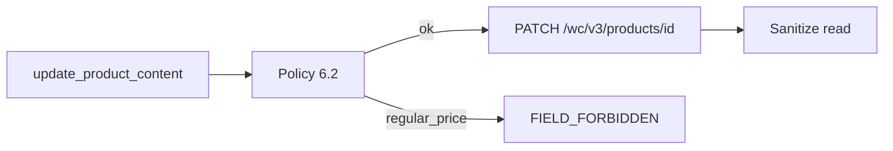

# TDD: woocommerce-product-content

## 1. Header & Metadata

| Field | Value |
|-------|-------|
| Title | woocommerce-product-content — conteúdo editorial de produto |
| Status | Draft |
| Date | 2026-08-17 |
| Last updated | 2026-08-17 |
| Tech lead | TBD |
| Team | TBD |
| Epic / ticket | TBD |
| Size | Small |
| Type | Integration |
| Depends on | env-auth, mcp-runtime |
| Source harness | `docs/harness/features/feature-woocommerce-product-content.md` |

## 2. Technical Solution

**Design pattern (escolhido):** Policy — allowlist §6.2 e sanitização de resposta (INV-002, INV-008). Preço/stock nunca no write nem no result.

### HTTP contract

| Tool | Method | Path |
|------|--------|------|
| `list_products` | GET | `/wp-json/wc/v3/products` |
| `get_product_content` | GET | `/wp-json/wc/v3/products/{id}` |
| `update_product_content` | PATCH | `/wp-json/wc/v3/products/{id}` |

Write allowlist: `name`, `slug`, `description`, `short_description`, `images`, `catalog_visibility` (`visible`\|`search`\|`hidden`), `categories`/`tags`.

Write forbid (erro, não strip): `regular_price`, `sale_price`, `price`, sale dates, `on_sale`, stock/SKU, tax, shipping, downloads, `meta_data`, etc.

Read: nome/descrição/imagens/slug/status/permalink. Sem preço, stock, SKU, `meta_data`, emails, IDs de cliente.

POST criar produto e DELETE: `METHOD_FORBIDDEN`. Variations: sem escrita na v1.

Promoções de desconto: feature de cupons, não `sale_price`.

## 3. Context Pillars

Fonte: harness `feature-woocommerce-product-content.md` (verbatim).

### 1 — Como descreve a feature?

Manipular a WooCommerce API, com auth correcta já fornecida no env, só para conteúdo editorial de produtos: nome, descrição, descrição curta, slug, imagem/galeria, taxonomia editorial, `catalog_visibility` (`visible` | `search` | `hidden`).

Tools: `list_products` (id, name, slug, status, permalink), `get_product_content`, `update_product_content` (PATCH campos §6.2).

Escrita em `/wc/v3/products/{id}/variations` **desligada** na v1.

### 2 — Qual problema objetivamente ela resolve?

Chaves WC `read_write` conseguem mudar preço e stock. O MCP nativo do Woo expõe `products-update` comercial. Editores precisam de alterar textos/imagens de produtos **sem** poder alterar preço de produto, stock, SKU, envios, impostos ou criar/apagar produto. Cupons/promoções são outra feature (`feature-woocommerce-coupons-and-promotions`).

### 3 — Qual a solução esperada? Quais trade-offs ela envolve?

Só GET lista/detalhe e PATCH `/wp-json/wc/v3/products` e `/{id}`. Allowlist de escrita §6.2. Proibido no PATCH (erro explícito se o payload original as continha, não aplica o resto): `regular_price`, `sale_price`, `price`, sale dates, `on_sale`, stock/SKU, tax, shipping, downloads, `meta_data`, etc.

Leitura: pode devolver nome/descrição/imagens. **Não** incluir preços, stock, SKU, `meta_data`, emails, IDs de cliente.

Criar produto novo: nunca via MCP. DELETE: nunca.

Trade-off: variações ficam de fora na v1 (o mesmo objecto mistura nome com preço/stock). A capability WP não chega; o guard neste repo é obrigatório (PHP da loja é fora deste repo).

### 4 — Qual exemplo ou contexto temos do problema e da solução?

Pedido original: manipular a WooCommerce API dado que as auth correctas tenham sido fornecidas. Detalhe em `my_docs/mcpContext.md` §6.2, §6.3, tools §7.

Motivo v1 sem variações: o mesmo objecto mistura nome da variação (conteúdo) com `regular_price` / `stock_quantity`.

## 4. Context

Copy de produto é editorial; preço e stock são operações de loja. O MCP nativo Woo não faz essa distinção.

## 5. Problem Statement & Motivation

- PATCH com `regular_price` altera dinheiro (INV-002).
- Resposta crua ensina o modelo a reenviar preço (INV-008).
- Create produto implica SKU/preço.

Quantificação: TBD.

## 6. Scope

In scope (V1):

- list/get/PATCH conteúdo §6.2
- sanitizar leitura
- recusar create/delete/variations/preço

Out of scope:

- `sale_price` / stock / SKU
- POST/DELETE produto; variations write
- encomendas, clientes

Future (V2+):

- TBD: variation **content** only
- TBD: mais taxonomia

## 7. Risks

| Risk | Impact | Probability | Mitigation |
|------|--------|-------------|------------|
| Preço no PATCH | H | M | `FIELD_FORBIDDEN` |
| Preço na resposta | H | M | sanitização |
| Variations “só o nome” | H | M | rota desligada v1 |

## 8. Implementation Plan

| Phase | Task | TDD cycle | Owner | Estimate |
|-------|------|-----------|-------|----------|
| 1 | GET sanitizado | Red: sem preço na tool result → Green | TBD | 0.5d |
| 2 | PATCH allowlist | Red: `regular_price` → `FIELD_FORBIDDEN` → Green | TBD | 1d |
| 3 | deny create/delete/variations | Red: nunca emitidos → Green | TBD | 0.5d |

## 9. Security Considerations

- Authn: env-auth.
- Authz: Policy §6.2; sem `manage_woocommerce` no papel WP (loja).
- Respostas sem dados comerciais de produto.
- PHP filters na loja: recomendados, fora deste TDD.

## 10. Testing Strategy

| Type | Scope | Approach |
|------|-------|----------|
| Unit | Policy keys | — |
| Integration | fake WC | httptest |

Cenários: PATCH description OK; PATCH `regular_price` falha sem HTTP desse campo; GET sem preço/stock/SKU/`meta_data`; POST/DELETE produto nunca.

## 16. Dependencies

- env-auth, mcp-runtime.
- media-upload para `images`.
- Cupons: TDD separado; não misturar `sale_price`.
- WC REST products na loja.
