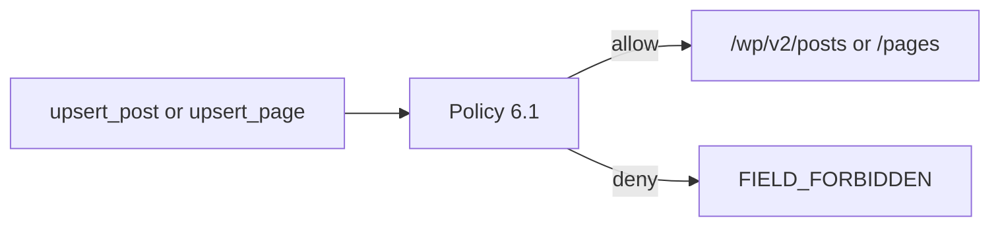

# TDD: wordpress-content

## 1. Header & Metadata

| Field | Value |
|-------|-------|
| Title | wordpress-content — posts e páginas via WP REST |
| Status | Draft |
| Date | 2026-08-17 |
| Last updated | 2026-08-17 |
| Tech lead | TBD |
| Team | TBD |
| Epic / ticket | TBD |
| Size | Small |
| Type | Integration |
| Depends on | env-auth, mcp-runtime |
| Source harness | `docs/harness/features/feature-wordpress-content.md` |

## 2. Technical Solution

**Design pattern (escolhido):** Policy — só rotas §5 de posts/páginas e campos §6.1; o resto é `ROUTE_FORBIDDEN` / `FIELD_FORBIDDEN` / `METHOD_FORBIDDEN`.

### HTTP contract

| Tool | Method | Path |
|------|--------|------|
| `list_posts` | GET | `/wp-json/wp/v2/posts` |
| `get_post` | GET | `/wp-json/wp/v2/posts/{id}` |
| `upsert_post` | POST or PATCH | `/wp-json/wp/v2/posts` or `/{id}` |
| `list_pages` | GET | `/wp-json/wp/v2/pages` |
| `get_page` | GET | `/wp-json/wp/v2/pages/{id}` |
| `upsert_page` | POST or PATCH | `/wp-json/wp/v2/pages` or `/{id}` |

Write body allowlist: `title`, `content`, `excerpt`, `slug`, `status` (`draft`\|`publish`\|`pending`), `featured_media`, `categories`/`tags` (posts).

Read: `id`, `type`, `link`, `title`, `content`, `excerpt`, `slug`, `status`, `featured_media`, `modified`. Sem author detalhado nem emails.

Exemplo write: `{ "title": "...", "content": "...", "status": "draft" }`. Default create: `draft`. DELETE: nunca (unpublish = `status: draft`). LiveCanvas: editar `content`, não a API LiveCanvas.

Timeout 10s; POST/PATCH sem retry; GET ≤ 1 retry.

## 3. Context Pillars

Fonte: harness `feature-wordpress-content.md` (verbatim).

### 1 — Como descreve a feature?

Manipular a WordPress API, com auth correcta já fornecida no env, para alterar páginas (`page`) e posts (`post`): criar ou actualizar conteúdo editorial.

Permitido no body de POST/PATCH: `title`, `content`, `excerpt`, `slug`, `status` (`draft` | `publish` | `pending`), `featured_media`, `categories`/`tags` (posts).

Páginas LiveCanvas: o HTML vive em `content.rendered` / `content.raw`. O MCP edita `content`; não usa a API LiveCanvas.

### 2 — Qual problema objetivamente ela resolve?

Editores, copy e agência precisam de alterar páginas e posts sem aceder a users, settings, plugins, temas, comentários ou DELETE. A REST da loja é deny-by-default; o MCP autentica-se servidor-a-servidor e não pode ser um cliente WP aberto.

### 3 — Qual a solução esperada? Quais trade-offs ela envolve?

Cliente HTTP só para `/wp-json/wp/v2/posts` e `/wp-json/wp/v2/pages` (GET, POST, PATCH) e `/{id}`. Structs allowlisted. Leitura devolve `id`, `type`, `link`, `title`, `content`, `excerpt`, `slug`, `status`, `featured_media`, `modified`. Não devolver `author` detalhado nem emails.

Unpublish = `status: draft` via PATCH. DELETE: nunca. Criar post/página: permitido. Default de criação: `draft`. Não publicar conteúdo gerado sem o humano confirmar, se a tool receber `status`.

Trade-off: sem meta livre, ACF, template PHP, `password`, `private`. Homolog primeiro em alterações em massa.

### 4 — Qual exemplo ou contexto temos do problema e da solução?

Tabela §5 e §6.1 / tools §7 em `my_docs/mcpContext.md`. Pedido original: manipular a WordPress API dado que as auth correctas tenham sido fornecidas.

Paths:

- GET, POST, PATCH `/wp-json/wp/v2/posts`, `/wp-json/wp/v2/posts/{id}`
- GET, POST, PATCH `/wp-json/wp/v2/pages`, `/wp-json/wp/v2/pages/{id}`

## 4. Context

Editores precisam de copy em WP sem papel de admin. A REST da loja é fechada a anónimos; o MCP usa o user dedicado.

## 5. Problem Statement & Motivation

- Sem allowlist, um PATCH leva `author` / `password` / meta.
- DELETE de conteúdo é irreversível no MCP (INV-006).
- GET `/wp/v2/users` vaza contas.

Não resolver: editores continuam no admin ou usam Woo MCP aberto. Quantificação: TBD.

## 6. Scope

In scope (V1):

- list/get/upsert posts e pages
- campos §6.1; default `draft`
- sanitizar leitura (sem email/author detalhado)

Out of scope:

- DELETE; `/wp/v2/users`, settings, plugins, themes, comments
- LiveCanvas API; ACF/meta livre; `private`+password
- PHP / shortcode handlers

Future (V2+):

- TBD: allowlist ACF pontual
- TBD: revisions
- TBD: bulk com confirmação de publish

## 7. Risks

| Risk | Impact | Probability | Mitigation |
|------|--------|-------------|------------|
| Publish sem humano | M | H | Default `draft`; instruções |
| Campo extra no body | H | M | `FIELD_FORBIDDEN` |
| Chamada a `/users` | H | L | Policy de rota |

## 8. Implementation Plan

| Phase | Task | TDD cycle | Owner | Estimate |
|-------|------|-----------|-------|----------|
| 1 | GET list/get | Red: shape de leitura → Green: Policy + HTTP fake | TBD | 0.5d |
| 2 | upsert allowlist | Red: `password` → `FIELD_FORBIDDEN` → Green | TBD | 1d |
| 3 | DELETE / users | Red: nunca emitidos → Green: Policy | TBD | 0.5d |

## 9. Security Considerations

- Authn: env-auth Basic.
- Authz: Policy §5/§6.1.
- PII: não devolver emails.
- Input validation: schema = allowlist.
- Audit: tool + id + store id; sem body com secrets.

## 10. Testing Strategy

| Type | Scope | Approach |
|------|-------|----------|
| Unit | Policy campos/status | — |
| Integration | POST/PATCH fake WP | httptest |

Cenários: upsert title+content; `FIELD_FORBIDDEN` em `author`; DELETE; GET users nunca; create sem status = `draft`.

## 16. Dependencies

- env-auth, mcp-runtime.
- media-upload para `featured_media` (IDs).
- WP REST `/wp/v2/posts|pages` na loja.
